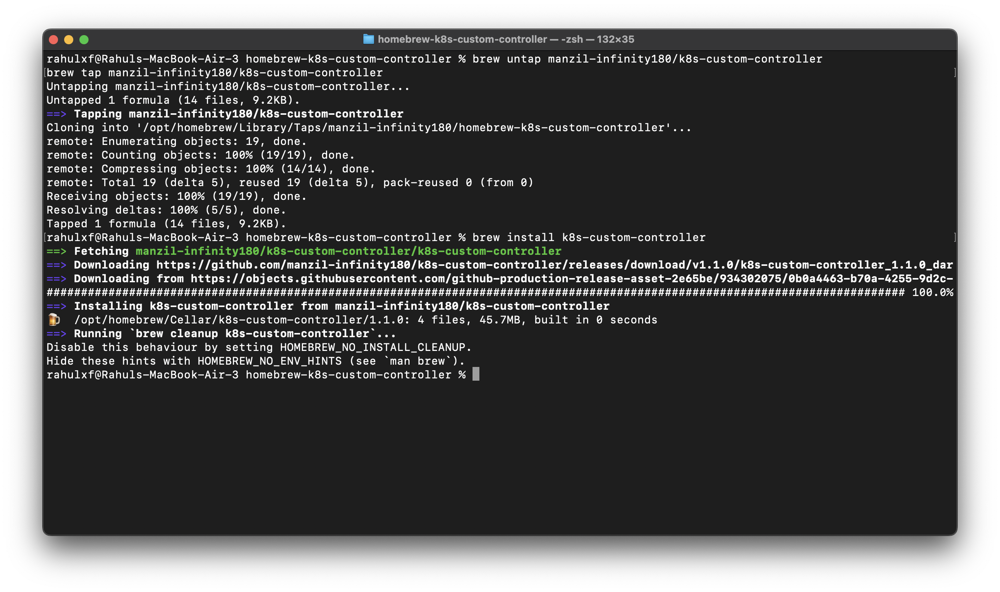

# Homebrew for k8s-custom-controller
> Check out the main repo [k8s-custom-controller](https://github.com/manzil-infinity180/k8s-custom-controller)

```
gh repo create manzil-infinity180/k8s-custom-controller--public
```

Install from brew:
```
brew tap manzil-infinity180/k8s-custom-controller
brew install k8s-custom-controller
```

```
brew untap manzil-infinity180/k8s-custom-controller
```

## NOTE 
If your file is: `Formula/k8s-custom-controller.rb` Then your class must be: `class K8sCustomController < Formula`(`k8s-custom-controller.rb → K8sCustomController`)



---

# How to test this?

```ts
rahulxf@Rahuls-MacBook-Air-3 ~ % which k8s-custom-controller     <-
/opt/homebrew/bin/k8s-custom-controller                
rahulxf@Rahuls-MacBook-Air-3 ~ % kubectx      <- ( kubectl config get-contexts )
cluster1
k3d-kubeflex
k3d-testing-brew <-
kind-rahulxf
minikube
wds1
rahulxf@Rahuls-MacBook-Air-3 ~ % CONTEXT=k3d-testing-brew k8s-custom-controller         <-
2025/05/19 18:06:42 .env file not found, assuming environment variables are set
k3d-testing-brew
Deployment Added:
Name: coredns
ADDED: Name=coredns, Namespace=kube-system, UID=b06cf860-1092-46a3-903a-27939cab53c9, Created=2025-05-19 18:04:07 +0530 IST
Deployment Added:
Name: local-path-provisioner
ADDED: Name=local-path-provisioner, Namespace=kube-system, UID=de3f6530-d3e9-457b-8d2d-626468ee3951, Created=2025-05-19 18:04:07 +0530 IST
Deployment Added:
Name: metrics-server
ADDED: Name=metrics-server, Namespace=kube-system, UID=c2d01b0b-19f5-4d45-aa4b-f43c2e96952e, Created=2025-05-19 18:04:08 +0530 IST
Deployment Added:
Name: traefik
ADDED: Name=traefik, Namespace=kube-system, UID=8c8a1325-6268-4ea4-b588-6821ab2457ed, Created=2025-05-19 18:05:00 +0530 IST
sync deployment, services "metrics-server" already exists
sync deployment, services "traefik" already exists
Deployment Added:
Name: rahulxf-brew
ADDED: Name=rahulxf-brew, Namespace=default, UID=df43af02-b2bb-44fd-8d25-835236ef65a1, Created=2025-05-19 18:07:49 +0530 IST
...
```


https://github.com/user-attachments/assets/a0745ef4-eede-4baa-babf-e6855fecd259


